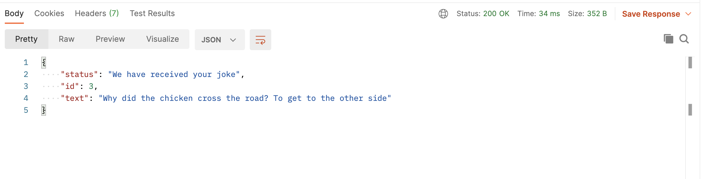

<!-- omit in toc -->
# HOTH 8 Workshop: Introduction to Servers

**Teachers**: [Timothy Gu](https://github.com/TimothyGu), [Jamie Liu](https://github.com/jamieliu386)

<!-- omit in toc -->
## Resources

- [Slides](https://docs.google.com/presentation/d/1h6KdlwfDfh8SBBBxGMGJb0OhJ5vSLsI2L9Zz3Yn7BR0/edit#slide=id.gb62b40d382_0_5)

<!-- omit in toc -->
## What we'll be learning today
- [What you'll need for this workshop](#what-youll-need-for-this-workshop)
- [What is a Server?](#what-is-a-server)
- [HTTP](#http)
  - [HTTP Requests](#http-requests)
    - [Parts of a URL](#parts-of-a-url)
    - [The GET Method](#the-get-method)
    - [The POST Method](#the-post-method)
  - [HTTP Responses](#http-responses)
    - [HTTP Status Codes](#http-status-codes)
- [What is Node.js?](#what-is-nodejs)
- [Express](#express)
- [Demo](#demo)
  - [Plain Text Response](#plain-text-response)
  - [Serving Static Files](#serving-static-files)
  - [JSON response](#json-response)
  - [POST request](#post-request)


## What you'll need for this workshop
If you want to follow along with this workshop, it will be helpful to have the
following:
- basic JavaScript knowledge (see the HOTH 8 workshop on HTML/CSS/JS, but feel
  free to skip straight to the JS portion)
- some familiarity with the command line, just enough to navigate around with
  `cd`
- a code editor (like [VSCode](https://code.visualstudio.com/))
- [Postman](https://www.postman.com/downloads/) (no account necessary, just
  download the app)
- [Node.js](https://nodejs.org/en/) (you'll need this in order to write and run
  a server in JavaScript)

## What is a Server?

Let's take a look at a well-known app like Facebook. Facebook hosts the
well-known "[UCLA Memes for Sick AF
Tweens](https://www.facebook.com/groups/uclamemes)" group, where individual
users can share memes with the entire UCLA community. However, how does it
actually work? How do we bring the meme image (that previously existed only as
a file on a student's computer) online and available for everyone to see?


One solution is using a **server**. The author of the meme can send the meme
image to a single computer known as the "server" that stores all the memes in
every single Facebook group. In the mean time, other students can retrieve only
those memes that are relevant to them (in this case, UCLA memes) by talking to
the server.


A server could be really helpful for a hackathon project, if you want

- To have multiple users of your app interact, and/or
- (_if you are making a web app_) To make your website accessible to everyone
  in the world.

In particular, servers can be really useful for both **web apps**, **mobile
apps** (iOS, Android), and even **games** that have an online component (like
an in-game chat, for instance).

Now, of course popular applications like Facebook and Google require a LOT of
servers to keep running, because we can't really build a single computer
powerful enough to talk to all the clients in the world. But for today, we will
just have one computer (your computer!) act as a server, which likely will be
more than enough to allow your hackathon project to work ☺

## HTTP

We now know that we can make computers talk to each other. But how does that
work? The answer is something called HTTP. The HyperText Transfer Protocol
(HTTP) is the standard way for computers to communicate with each other on the
Web. A "protocol" can be likened to a natural language: it's a set of rules
that the server and client can both follow to communicate.

### HTTP Requests

In HTTP, the general flow is that the client (your laptop or cell phone) would
first send a _request_ message to the server, asking for some resource.

For
instance, when you type `https://hoth.uclaacm.com/` into the browser's
navigation box and hit <kbd>Enter</kbd>, the browser would send an HTTP request
on your behalf to the server. Another example is uploading a meme: the browser
would send an HTTP request to the server with the meme attached. The browser
would then wait for the server to respond with what we need.

An HTTP request generally consists of a few parts:

- The **HTTP method** is the primary way the server understands the
  client/browser's intent. The two most common ones are GET and POST.
- The **endpoint**, which is a condensed version of the URL to request.
- The **headers**, containing additional miscellaneous pieces of information the
  server may find useful.
- The **body**, any data the client wants to upload to the server (like the
  meme!).

#### Parts of a URL

This would be a good time to talk a bit about URLs. You know, the boring strings
one types into the browser address bar. They actually have quite a few parts in
them.

```
https  ://  www.facebook.com   /groups/zoommemes/   ?id=1   #post12345
scheme            host               path           query    fragment
```

The scheme refers to the protocol (here we have
[HTTPS](https://en.wikipedia.org/wiki/HTTPS), or HTTP Secure). The host
identifies _which server_ we are talking to. The path and query further identify
which resource _on the server_ we want. Finally, the fragment tells the browser
which _part of the page_ to scroll to.

#### The GET Method

The GET method is used for **retrieving** information from the server. When you
navigate to a webpage through the address bar, this is what the browser sends
under the hood.

Here's an example of a GET request that I get when I navigate to
`https://www.facebook.com/groups/zoommemes`:

```http
GET /groups/zoommemes HTTP/1.1        =  method + endpoint
Host: www.facebook.com                ┐
Accept: */*                           ┘  headers
```

Here, we see the `GET` in the first line. The `/groups/zoommemes` part refers to
the URL path (the query would also go here). The `Host:` and `Accept:` lines are
the HTTP request headers; the `Host` header defines the URL host, while the
`Accept` header defines what kind of response the client is able to consume –
anything in this case, apparently. (The `*` is the wildcard operator that
matches any input.)

We mentioned earlier that HTTP requests can have a body. But where's the body?
It turns out that GET requests cannot have bodies since they are solely used to
retrieve things from the server.

#### The POST Method

The POST method is for **sending** information to the server. When you upload a
meme, or submits a form, or logs into a website, this is the type of request
that generally happens. Here is an example:

```http
POST /groups/zoommemes/upload HTTP/1.1       =  method + endpoint
Host: www.facebook.com                       ┐
Accept: */*                                  │  headers
Content-Type: application/json               │
Content-Length: 19                           ┘

{"meme": "picture"}                          =  body
```

We see that first line has been changed to reflect the POST method. The
`Host` and `Accept` headers are the same as before, but we also got two more
headers: `Content-Type` and `Content-Length`. These two have to do with the
characteristics of the body we send.

In this example, we are sending a JSON object to the server,
and that's why we have `application/json` as the `Content-Type`. The
`Content-Length` is the number of bytes/characters in the body.

Other types of request bodies are possible. For instance,
`application/x-www-form-urlencoded` format is an alternative to JSON that
simulates the query part of the URL. The following JSON and
`www-form-urlencoded` bodies have the same meaning:
```json
{"key1": "foo", "key2": "bar"}
```
```
key1=foo&key2=bar
```

We can send even more types of bodies to the server. With `Content-Type:
image/png` or `image/jpeg`, we can send an image directly. With
`Content-Type: text/html`, we can even use an HTML page as the request body. (Of
course, if the server doesn't understand why we are sending an HTML page, it may
respond with an error; see the response section for more info.)

### HTTP Responses

Just like HTTP requests, HTTP responses contain a header and a body. The header
consists of a status code and additional HTTP headers. The body contains data
sent by the server. This can be HTML, JSON, JPEG images, plain text, and
[more](https://en.wikipedia.org/wiki/Media_type).

Here's an example of an HTTP response.

- In the first line, we see a status code of "200", with the meaning "OK".
- We also see a header called "Content-Type" set to "text/html", telling us that
  the type of the body is HTML.
- In the body, we received a small HTML page.

#### HTTP Status Codes

One very important part of the HTTP response is the status code, which
indicates whether the HTTP request was successful or not. Status codes come in
a few categories:

```
2xx (200-299): request was successful
4xx (400-499): unsuccessful, the client messed up
5xx (500-599): unsuccessful, the server messed up
(and a couple others we won't worry about)
```

For fun, check out [http.cat](https://http.cat/).

One common status code you may have seen is 404, which means "Not Found". This
could happen if you visit a page that does not exist, and usually you'll be
redirected to a 404 page to indicate the error. For example, here's what I see
when I go to [hack.uclaacm.com/blahblahblah](https://hack.uclaacm.com/blahblahblah):


I can also open the Chrome DevTools and go to the Network tab. If I refresh the
page, I see this:


In fact, I can click on "blahblahblah" to see the following response:


## What is Node.js?

Node.js is a "JavaScript runtime environment" according to Google, which isn't
the most helpful description. But not to worry, we'll explain what it means and
why Node.js is useful.

In the year 30 B.N. (Before Node), JavaScript could only be run in the browser!
However, some very intelligent people realized that JavaScript is pretty cool
and useful. So, Node.js was created!

With Node.js, we can now run JavaScript code on our own computers, even if we're
not using a web browser and even without an internet connection! Node.js uses
the same technology inside our web browsers to make JavaScript work outside the
browser! This was a huge breakthrough for JavaScript, because it meant that
we could also use JavaScript for our servers!

Instead of this:


We now have this:


This is really nice for us as developers, because we only need to know a single
language (JavaScript) in order to write both frontend (client) and backend
(server) code! In addition, we can be sure that any JavaScript tools used are
available on both the frontend and the backend. If we were to use a different
language in the backend, we would have to look for tools written for that
language, too.

## Express.js

Node.js provides the _capability_ of making an HTTP server in JavaScript.
Express is a tool that makes doing so _easy._

## Demo

Create a new folder, which will contain the server we write. Navigate to the
folder in your command line and run the following:

```sh
npm init
```

When prompted, click "Enter" to go through the prompts until the command is
finshed. This will create a new npm project in the current directory. Then,
run:

```sh
npm install express
```

This will install express, allowing us to use it to create our server!

### Plain Text Response

We first create a skeleton app, by putting the following in `index.js`:
```js
"use strict";                              // Helps prevent typos:
                                           // https://developer.mozilla.org/en-US/docs/Web/JavaScript/Reference/Strict_mode
const express = require("express");        // Indicates that your app needs Express
                                           //
const app = express();                     // Create a new Express app
                                           //
//  vvv this means it's a GET request      //
app.get("/joke", (request, response) => {  // Defines what to do when the user makes
                                           // a GET /hello request. We receive info
                                           // about the request and also a response
                                           // to write our data into.
                                           //
  response.setHeader("Content-Type",       // We set the Content-Type header to
                     "text/plain");        // plain unformatted text.
                                           //
  response.send("What happens to a frog's car when it breaks down? It gets toad away.");
                                           // Send the response.
});                                        //
                                           //
app.listen(3000);                          // 3000 is a number we call the _port_.

console.log("Listening on http://localhost:3000/");
console.log("Press Ctrl-C to quit");
```

To run this app, execute:
```sh
node index.js
```

Now, go to http://localhost:3000/joke, and you should see "What happens to a
frog's car when it breaks down? It gets toad away." in a monospace/typewriter
font, indicating that the browser received a plain text response. The 3000
number corresponds with what you called `app.listen()` with. The `localhost`
part of the URL refers to your own computer as the server host.

### Serving Static Files

Okay, that works, but isn't very interesting. Can we send an HTML file to the
client?

Let's create a `public` folder in our project and add a file called `joke.html`
with the following contents:

```html
<!DOCTYPE html>
What happens to a frog's car when it breaks down? It gets <em>toad away</em>.
```

Now, add the following to `index.js`, **after** `const app` but **before**
`app.listen()`:

```js
app.use(express.static("public"));
```

Go to http://localhost:3000/joke.html. Oh no! There was an error :(

This is because we need to **restart** the server: type Ctrl-C (same for Mac
users), and then `node index.js` again.

Navigate to http://localhost:3000/joke.html, and you should see the joke with
extra _emphasis_.

This is often useful for serving images.

### JSON response

Let's create an endpoint where we can see a bunch of jokes, represented in JSON
format.

First, let's add some jokes to our server. Add the following lines to
`index.js` after the `const app = express();` line:

```js
const jokes = ["What happens to a frog's car when it breaks down? It gets toad away",
               "Why was six scared of seven? Because seven 'ate' nine.",
               "What starts with E, ends with E, and has only 1 letter in it? Envelope :D"];
```

Now, let's create an endpoint to see all the jokes we have on the server:
```js
app.get("/all", (request, response) => {
  const jokesRes = [];
  for (let i = 0; i < jokes.length; i++) {
    jokesRes.push({
      id: i,
      text: jokes[i],
    });
  }
  response.json(jokesRes);
});
```

What is this code doing? We first create an empty array `jokesRes`, which we
then populate with JS objects corresponding to each joke. These objects each
contain an `id` number as well as the joke itself. Finally, we send the
resulting array as a JSON response.

We can see the result of this by visiting http://localhost:3000/all after
restarting the server.

Now, we can try to write an endpoint to retrieve a specific joke by id. To do
this, we can use a "route parameter". Add this to your code:

```js
app.get("/joke/:id", (request, response) => {
  const jokeID = Number(request.params.id);
  if (isNaN(jokeID) || jokeID < 0 || jokeID >= jokes.length) {
    response.setHeader("Content-Type", "text/plain;charset=utf-8");
    response.status(404);
    response.send("Joke not found 😢");
    return;
  }

  response.json({
    id: jokeID,
    text: jokes[jokeID],
  })
});
```

We access the `id` by using `request.params.id`, and convert it to a number
using `Number()`. If the `id` is NaN (not a number), or is too big or small,
then we return a `404` error. Otherwise, we send the corresponding joke along
with the `id` back to the client.

### POST request

Let's say we now want to create a POST endpoint where users can upload jokes
in JSON format. The request body can be accessed through `request.body`.
That property is a bit hard to use though, since it is a stream of
bytes rather than the parsed JSON object.

Fortunately, Express provides a function `express.json` that acts as a
_middleware_ to decode the JSON for us. We will also send a JSON object back
to the user. We can use it like this:
```js
//  vvvv notice how we changed this from `get` to `post`
app.post("/joke", express.json(), (request, response) => {
  if (!request.body || !request.body.text) {
    response.setHeader("Content-Type", "text/plain");
    response.status(400);
    response.send("Invalid request body");
    return;
  }

  const id = jokes.length;
  jokes.push(request.body.text);
  response.json({
    status: "We have received your joke",
    id,
    text: request.body.text,
  });
});
```

We can test it by sending a request in Postman like this:


The response should look something like:



---

To see all of the code we wrote, check out the demo folder above! Good luck
and feel free to ask any questions you have on Discord :)
